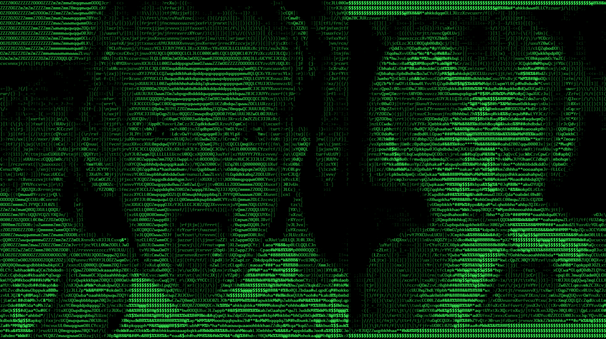
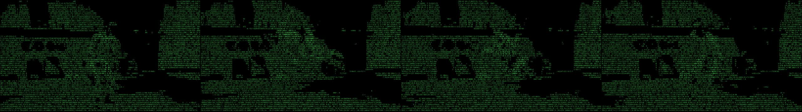
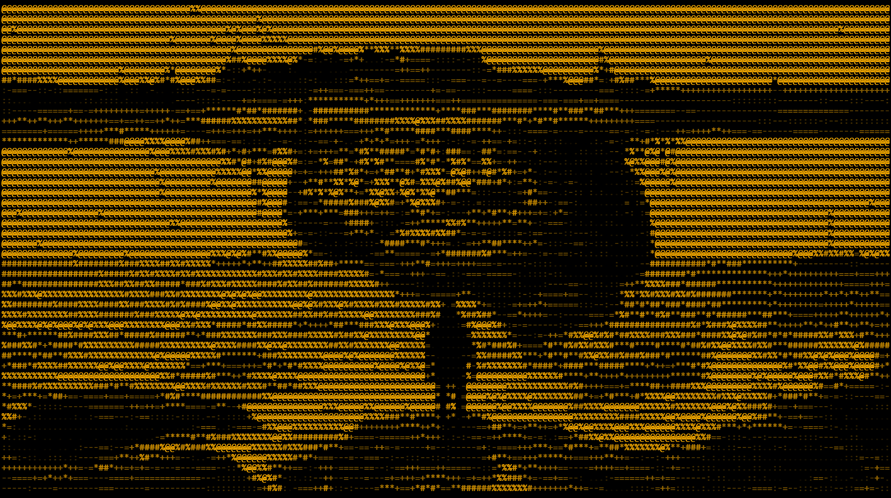
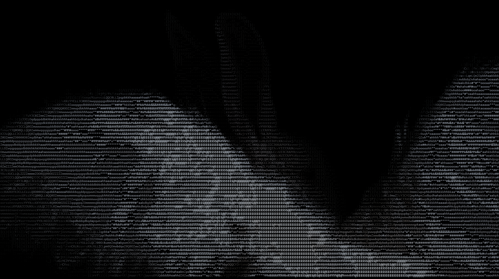
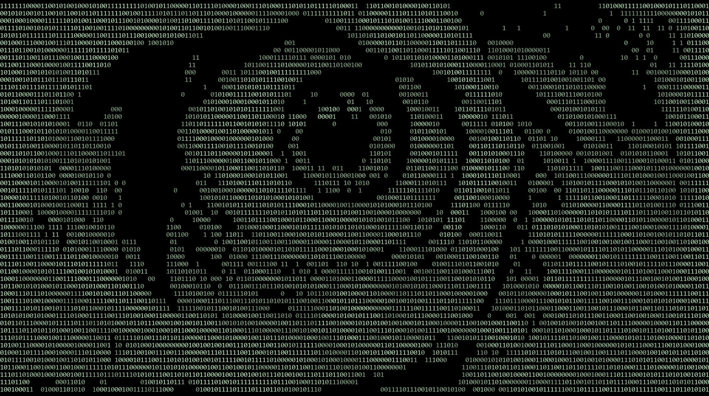
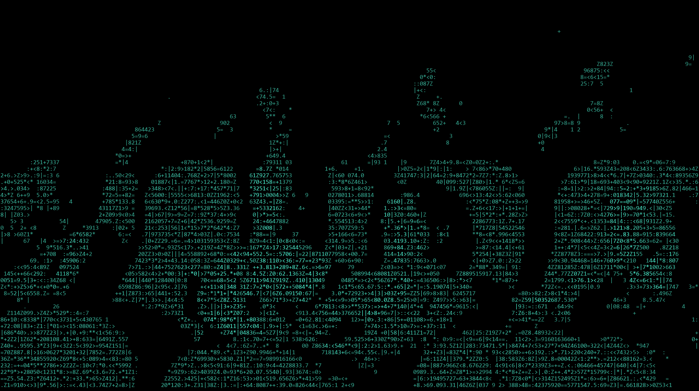

# MSCH Code Matrix showcase

Examples supplied by Mario from the MSCH Node Showcase collection. The output files are preserved as supplied.

Rebuilds every frame from monospace glyphs whose density follows image brightness. IMAGE in / IMAGE out.

- ascii_portrait_green - ascii_dense + by_brightness, bold, 240 columns (the classic ASCII-portrait look)
- binary_eye_white - binary 0/1 charset, random pick gated by threshold: the figure emerges from where digits appear
- ascii_original_colors - color_mode=original keeps the source palette inside the glyphs
- ascii_amber - ascii_simple charset, amber phosphor
- matrix_random_cyan - matrix charset, random pick, cyan
- matrix_rain_robot.mp4 - video input, matrix charset with flicker=0.4 so glyphs re-randomize every frame (code-rain shimmer)

## Gallery

Click a video preview to open its file on GitHub, or use the download link.

### Matrix rain robot

[Open MP4](outputs/matrix_rain_robot_00001.mp4) · [Download original](https://github.com/mariobilly/msch-comfyui-nodes/raw/refs/heads/main/components/code_matrix/examples/showcase/outputs/matrix_rain_robot_00001.mp4)

## Still images and diagnostic outputs

### Ascii amber

### Ascii original colors

### Ascii portrait green

### Binary eye white

### Matrix random cyan

## API workflows

These JSON files are ComfyUI API prompts, not canvas-format workflows. Send one as the `prompt` field of a `/prompt` request, or use a tool that accepts API workflows. A canvas importer may require conversion.

Choose your own source media and installed models before running. Source photos, video clips, audio and model weights are not bundled in this showcase. The supplied render settings and connections are retained; machine-specific absolute paths in the API copies use `INPUT_ROOT/` or `LOCAL_FILES/` placeholders. Replace these with paths valid on your computer.

- [code_matrix_stills_api.json](workflows_api/code_matrix_stills_api.json): `CodeMatrixASCII`, `LoadImage`, `SaveImage`.
- [code_matrix_rain_video_api.json](workflows_api/code_matrix_rain_video_api.json): `CodeMatrixASCII`, `VHS_LoadVideo`, `VHS_VideoCombine`.

### Input files and models

| Workflow | Node | Input | Source selection |
|---|---|---|---|
| `code_matrix_stills_api.json` | `1` | `image` | `msch_showcase/stills/child_scream.jpg` |
| `code_matrix_stills_api.json` | `4` | `image` | `msch_showcase/stills/eye_paper.jpg` |
| `code_matrix_stills_api.json` | `7` | `image` | `msch_showcase/stills/rabbit.jpg` |
| `code_matrix_stills_api.json` | `10` | `image` | `msch_showcase/stills/floating_island.jpg` |
| `code_matrix_stills_api.json` | `13` | `image` | `msch_showcase/stills/cinema_vampires.jpg` |
| `code_matrix_rain_video_api.json` | `1` | `video` | `msch_robot.mp4` |

Install ComfyUI-VideoHelperSuite for the `VHS_*` loader/combine nodes.

## Source notes

The collection notes identify images from the Jim Morrison image library, Mario’s clips, and the Suno track “Crushing Syncopation”. Those source assets are not included separately. The rendered media is supplied as showcase material; the repository’s MIT license describes the node code and does not establish a separate license for underlying media.
