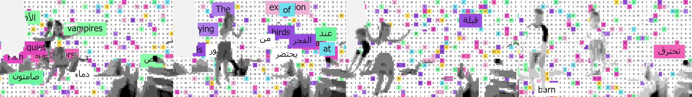
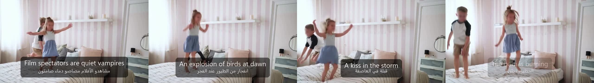
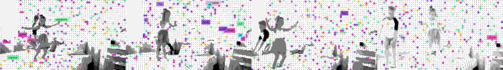

# MSCH Lyric Sync showcase

Examples supplied by Mario from the MSCH Node Showcase collection. The output files are preserved as supplied.

Rebuilds a video as a grid of coloured tiles filled with the lyric words; the subject emerges from the word tiles. Align snaps pasted lyrics onto a WhisperX word timeline (even fallback when no vocals are detected). Bilingual RTL Arabic supported.

- word_mosaic_kids.mp4 - 64-column mosaic, palette node, scrolling words, subject keyed automatically
- word_mosaic_kids_bold_grid.mp4 - 40 columns, bigger word boxes, left scroll
- caption_overlay_bilingual.mp4 - the simple subtitle-box alternative with English + Arabic and word highlighting
- Note: this excerpt of the song is instrumental, so Align used its even-distribution fallback for the timing.

## Gallery

Click a video preview to open its file on GitHub, or use the download link.

### Caption overlay bilingual

[Open MP4](outputs/caption_overlay_bilingual_00001-audio.mp4) · [Download original](https://github.com/mariobilly/msch-comfyui-nodes/raw/refs/heads/main/components/lyric_sync/examples/showcase/outputs/caption_overlay_bilingual_00001-audio.mp4)

### Word mosaic kids

[Open MP4](outputs/word_mosaic_kids_00001-audio.mp4) · [Download original](https://github.com/mariobilly/msch-comfyui-nodes/raw/refs/heads/main/components/lyric_sync/examples/showcase/outputs/word_mosaic_kids_00001-audio.mp4)

### Word mosaic kids bold grid

[Open MP4](outputs/word_mosaic_kids_bold_grid_00001-audio.mp4) · [Download original](https://github.com/mariobilly/msch-comfyui-nodes/raw/refs/heads/main/components/lyric_sync/examples/showcase/outputs/word_mosaic_kids_bold_grid_00001-audio.mp4)

## API workflows

These JSON files are ComfyUI API prompts, not canvas-format workflows. Send one as the `prompt` field of a `/prompt` request, or use a tool that accepts API workflows. A canvas importer may require conversion.

Choose your own source media and installed models before running. Source photos, video clips, audio and model weights are not bundled in this showcase. The supplied render settings and connections are retained; machine-specific absolute paths in the API copies use `INPUT_ROOT/` or `LOCAL_FILES/` placeholders. Replace these with paths valid on your computer.

- [lyric_sync_api.json](workflows_api/lyric_sync_api.json): `LoadAudio`, `LyricSyncAlign`, `LyricSyncMosaic`, `LyricSyncOverlay`, `LyricSyncPalette`, `VHS_LoadVideo`, `VHS_VideoCombine`.

### Input files and models

| Workflow | Node | Input | Source selection |
|---|---|---|---|
| `lyric_sync_api.json` | `1` | `video` | `msch_kids.mp4` |
| `lyric_sync_api.json` | `2` | `audio` | `msch_song_7s.mp3` |
| `lyric_sync_api.json` | `5` | `font_path` | `LOCAL_FILES/tahoma.ttf` |
| `lyric_sync_api.json` | `7` | `font_path` | `LOCAL_FILES/segoeui.ttf` |
| `lyric_sync_api.json` | `9` | `font_path` | `LOCAL_FILES/tahoma.ttf` |

Install ComfyUI-VideoHelperSuite for the `VHS_*` loader/combine nodes.

## Source notes

The collection notes identify images from the Jim Morrison image library, Mario’s clips, and the Suno track “Crushing Syncopation”. Those source assets are not included separately. The rendered media is supplied as showcase material; the repository’s MIT license describes the node code and does not establish a separate license for underlying media.
