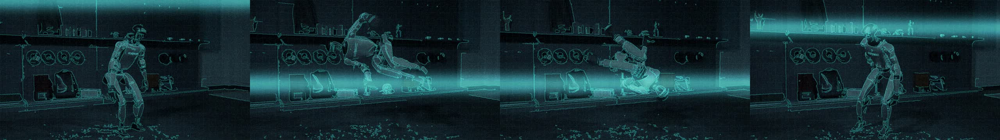
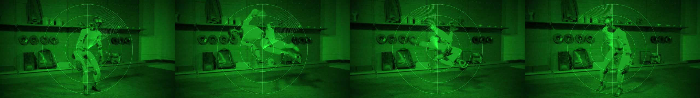
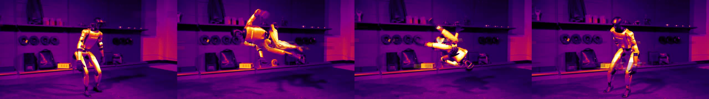
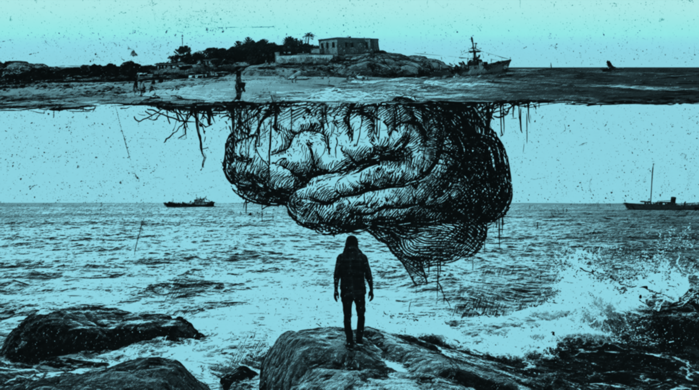
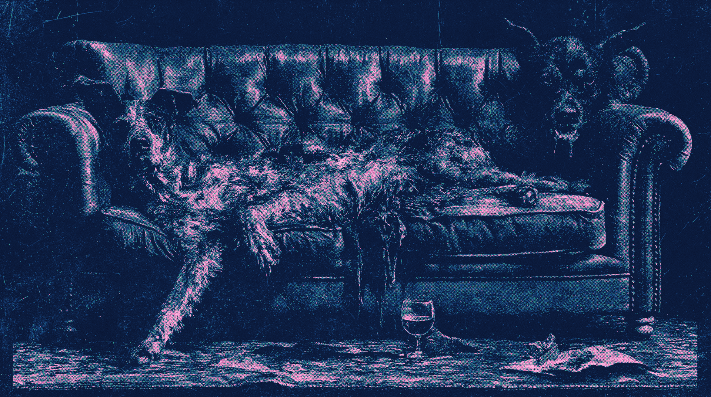
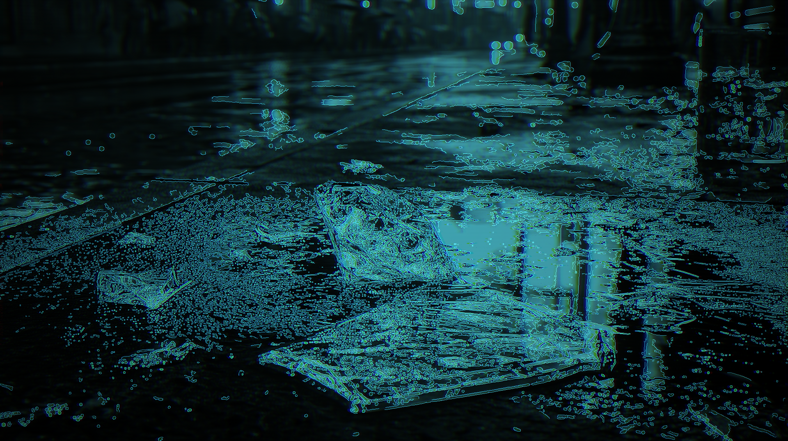
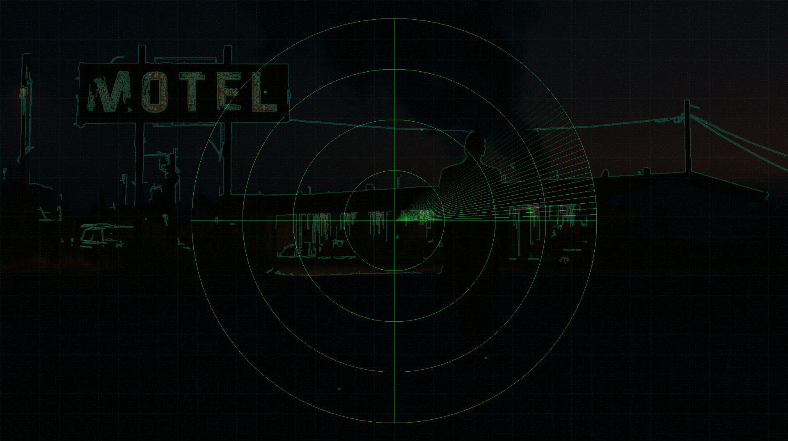
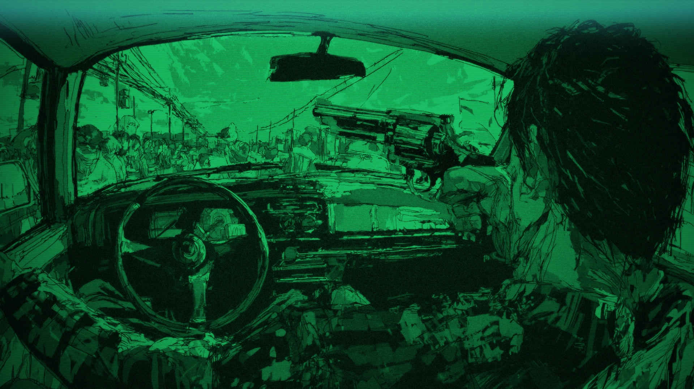
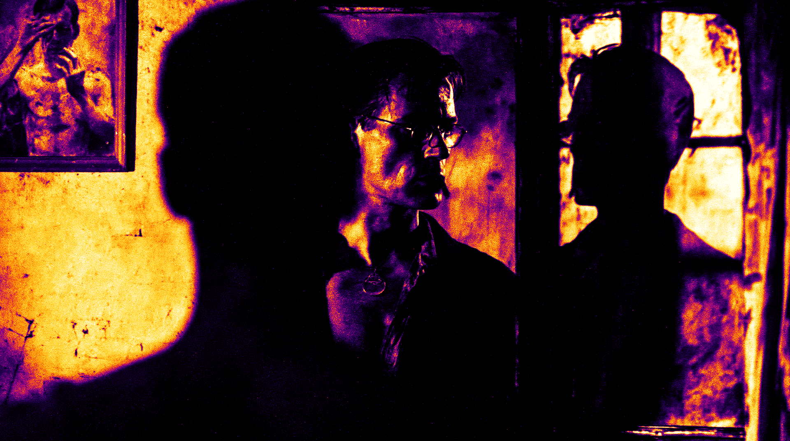
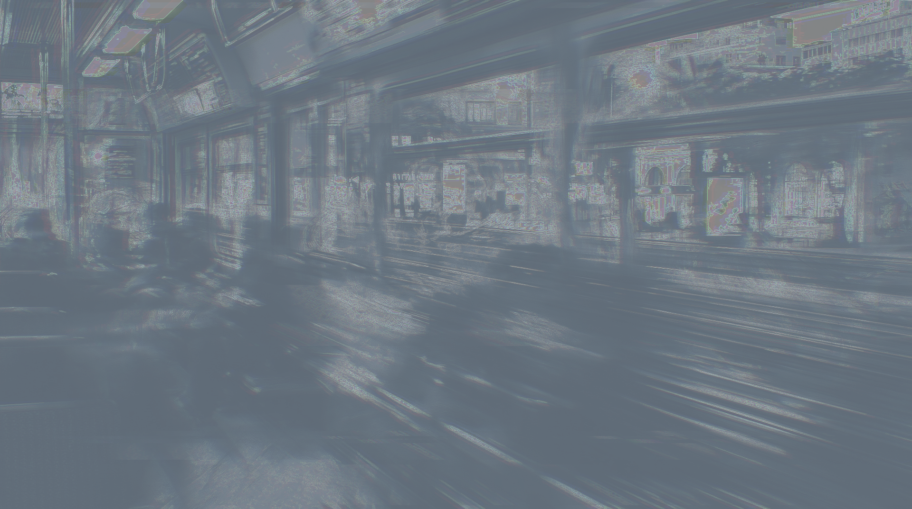

# MSCH Scan FX showcase

Examples supplied by Mario from the MSCH Node Showcase collection. The output files are preserved as supplied.

Stack up to 8 effects in order (thermal, nightvision, xray, lidar, wireframe, holo_sweep, hologram, chroma, glitch, hud, sonar, ekg, coderain, falsecolor, depthmap). Works on a still or a frame batch; animated effects move per frame.

- thermal_hud - FLIR ironbow + targeting reticle
- nightvision_hud - green phosphor + holo sweep + HUD
- xray_glitch - xray + chromatic aberration + datamosh glitch
- lidar_sonar - wireframe + lidar point cloud + sonar pulse
- hologram_coderain - volumetric hologram flicker + terminal code rain + EKG
- falsecolor - IR false colour + HUD
- depthmap_hud - luminance depth approximation + HUD + sweep
- robot_thermal_glitch.mp4 / robot_wireframe_lidar_hud.mp4 / robot_nightvision_sonar.mp4 - the same stacks on a moving robot clip (sweep, sonar, HUD animate per frame)

## Gallery

Click a video preview to open its file on GitHub, or use the download link.

### Robot nightvision sonar

[Open MP4](outputs/robot_nightvision_sonar_00001.mp4) · [Download original](https://github.com/mariobilly/msch-comfyui-nodes/raw/refs/heads/main/components/scanfx/examples/showcase/outputs/robot_nightvision_sonar_00001.mp4)

### Robot thermal glitch

[Open MP4](outputs/robot_thermal_glitch_00002.mp4) · [Download original](https://github.com/mariobilly/msch-comfyui-nodes/raw/refs/heads/main/components/scanfx/examples/showcase/outputs/robot_thermal_glitch_00002.mp4)

### Robot wireframe lidar hud

[Open MP4](outputs/robot_wireframe_lidar_hud_00001.mp4) · [Download original](https://github.com/mariobilly/msch-comfyui-nodes/raw/refs/heads/main/components/scanfx/examples/showcase/outputs/robot_wireframe_lidar_hud_00001.mp4)

## Still images and diagnostic outputs

### Depthmap hud

### Falsecolor

### Hologram coderain

### Lidar sonar

### Nightvision hud

### Thermal hud

### Xray glitch

## API workflows

These JSON files are ComfyUI API prompts, not canvas-format workflows. Send one as the `prompt` field of a `/prompt` request, or use a tool that accepts API workflows. A canvas importer may require conversion.

Choose your own source media and installed models before running. Source photos, video clips, audio and model weights are not bundled in this showcase. The supplied render settings and connections are retained; machine-specific absolute paths in the API copies use `INPUT_ROOT/` or `LOCAL_FILES/` placeholders. Replace these with paths valid on your computer.

- [scanfx_stills_api.json](workflows_api/scanfx_stills_api.json): `LoadImage`, `SaveImage`, `ScanFX`.
- [scanfx_stills_fix_api.json](workflows_api/scanfx_stills_fix_api.json): `LoadImage`, `SaveImage`, `ScanFX`.
- [scanfx_video_api.json](workflows_api/scanfx_video_api.json): `ScanFX`, `VHS_LoadVideo`, `VHS_VideoCombine`.

### Input files and models

| Workflow | Node | Input | Source selection |
|---|---|---|---|
| `scanfx_stills_api.json` | `1` | `image` | `msch_showcase/stills/silhouette.jpg` |
| `scanfx_stills_api.json` | `4` | `image` | `msch_showcase/stills/car_interior.jpg` |
| `scanfx_stills_api.json` | `7` | `image` | `msch_showcase/stills/city_blur.jpg` |
| `scanfx_stills_api.json` | `10` | `image` | `msch_showcase/stills/motel.jpg` |
| `scanfx_stills_api.json` | `13` | `image` | `msch_showcase/stills/diamonds_rain.jpg` |
| `scanfx_stills_api.json` | `16` | `image` | `msch_showcase/stills/spectator_dying.jpg` |
| `scanfx_stills_fix_api.json` | `10` | `image` | `msch_showcase/stills/motel.jpg` |
| `scanfx_stills_fix_api.json` | `7` | `image` | `msch_showcase/stills/city_blur.jpg` |
| `scanfx_stills_fix_api.json` | `13` | `image` | `msch_showcase/stills/floating_island.jpg` |
| `scanfx_video_api.json` | `1` | `video` | `msch_robot.mp4` |

Install ComfyUI-VideoHelperSuite for the `VHS_*` loader/combine nodes.

`scanfx_stills_fix_api.json` is the supplied follow-up workflow for corrected still outputs; both the original settings and the follow-up are included.

## Source notes

The collection notes identify images from the Jim Morrison image library, Mario’s clips, and the Suno track “Crushing Syncopation”. Those source assets are not included separately. The rendered media is supplied as showcase material; the repository’s MIT license describes the node code and does not establish a separate license for underlying media.
