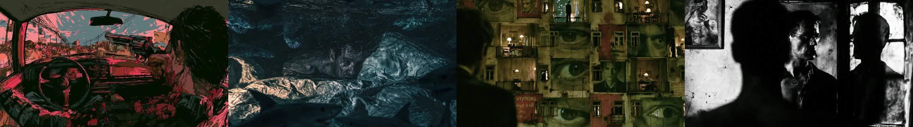
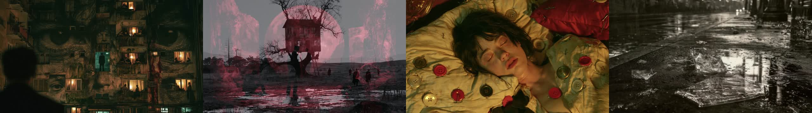

# MSCH Slideshow Forge showcase

Examples supplied by Mario from the MSCH Node Showcase collection. The output files are preserved as supplied.

Procedural Ken Burns slideshow: Director turns an image batch + preset + duration/beat-sync into an editable timeline JSON; GPU Motion Renderer renders it with torch/kornia into an IMAGE batch for VHS Video Combine.

- dynamic_wipes_beat_sync.mp4 - 12 photos, dynamic_wipes preset, beat_sync (2 beats per image) to the soundtrack, shuffled, 1280x720
- slow_cinematic_ken_burns.mp4 - 6 photos, slow_cinematic preset, 2.4 s per image, long dissolves

## Gallery

Click a video preview to open its file on GitHub, or use the download link.

### Dynamic wipes beat sync

[Open MP4](outputs/dynamic_wipes_beat_sync_00001-audio.mp4) · [Download original](https://github.com/mariobilly/msch-comfyui-nodes/raw/refs/heads/main/components/slideshow_forge/examples/showcase/outputs/dynamic_wipes_beat_sync_00001-audio.mp4)

### Slow cinematic ken burns

[Open MP4](outputs/slow_cinematic_ken_burns_00001.mp4) · [Download original](https://github.com/mariobilly/msch-comfyui-nodes/raw/refs/heads/main/components/slideshow_forge/examples/showcase/outputs/slow_cinematic_ken_burns_00001.mp4)

## API workflows

These JSON files are ComfyUI API prompts, not canvas-format workflows. Send one as the `prompt` field of a `/prompt` request, or use a tool that accepts API workflows. A canvas importer may require conversion.

Choose your own source media and installed models before running. Source photos, video clips, audio and model weights are not bundled in this showcase. The supplied render settings and connections are retained; machine-specific absolute paths in the API copies use `INPUT_ROOT/` or `LOCAL_FILES/` placeholders. Replace these with paths valid on your computer.

- [slideshow_forge_api.json](workflows_api/slideshow_forge_api.json): `LoadAudio`, `SlideshowForge_Director`, `SlideshowForge_GPURenderer`, `VHS_LoadImagesPath`, `VHS_VideoCombine`.
- [slideshow_forge_cinematic_api.json](workflows_api/slideshow_forge_cinematic_api.json): `SlideshowForge_Director`, `SlideshowForge_GPURenderer`, `VHS_LoadImagesPath`, `VHS_VideoCombine`.

### Input files and models

| Workflow | Node | Input | Source selection |
|---|---|---|---|
| `slideshow_forge_api.json` | `1` | `directory` | `INPUT_ROOT/msch_showcase/slideshow_b` |
| `slideshow_forge_api.json` | `2` | `audio` | `msch_song_12s.mp3` |
| `slideshow_forge_cinematic_api.json` | `1` | `directory` | `INPUT_ROOT/msch_showcase/slideshow_a` |

Install ComfyUI-VideoHelperSuite for the `VHS_*` loader/combine nodes.

## Source notes

The collection notes identify images from the Jim Morrison image library, Mario’s clips, and the Suno track “Crushing Syncopation”. Those source assets are not included separately. The rendered media is supplied as showcase material; the repository’s MIT license describes the node code and does not establish a separate license for underlying media.
