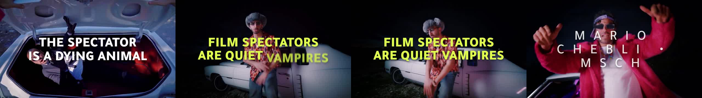
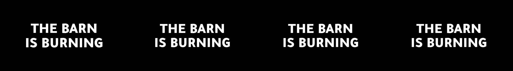
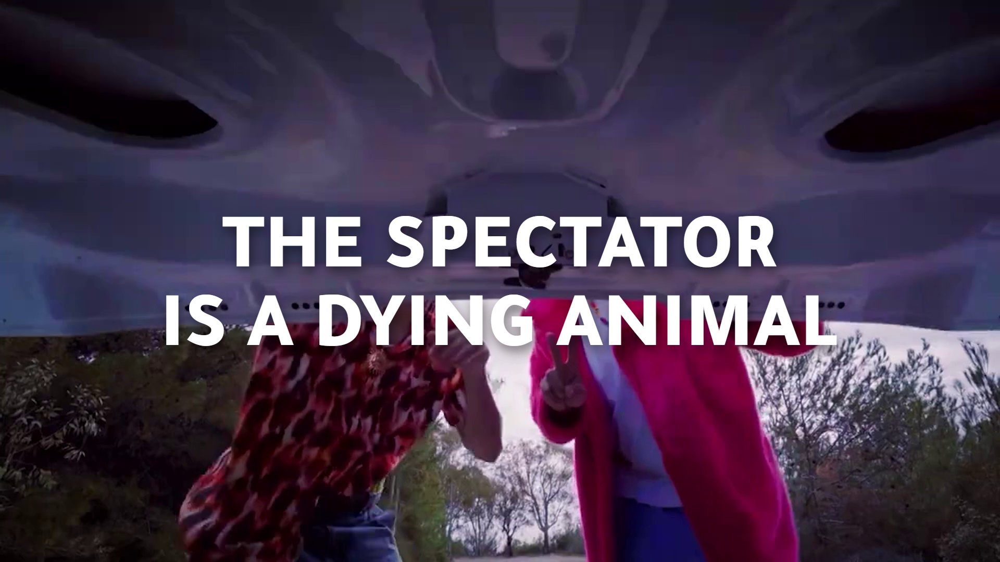
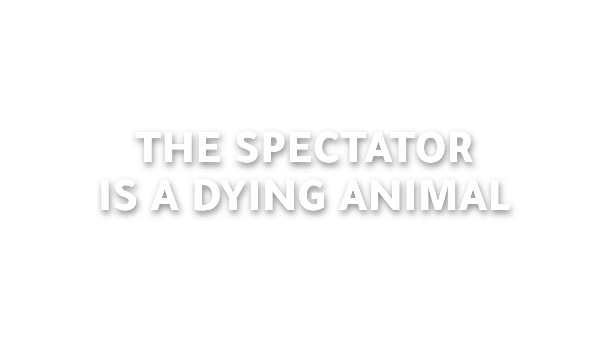
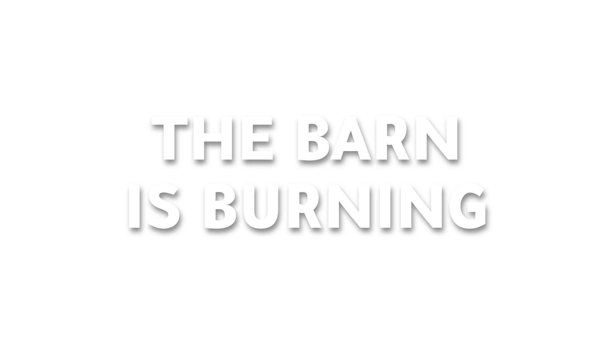
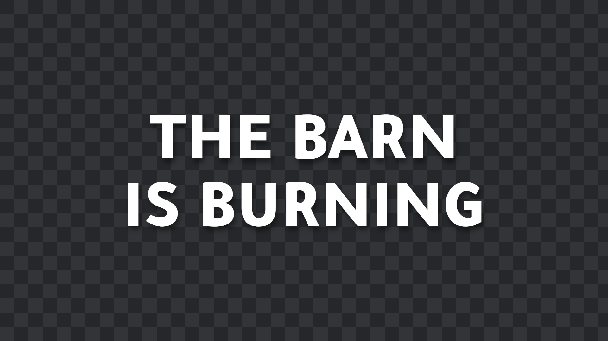

# MSCH Typort showcase

Examples supplied by Mario from the MSCH Node Showcase collection. The output files are preserved as supplied.

Standalone kinetic-typography renderer: up to 60 layers, Tajawal weights, line reveal / word cascade / scale impact / tracking reveal / drift / sweep animations, keyframes, audio reactions, transparent MOV, PNG sequence or MP4 composite over footage.

- showcase_quotes_over_video/typography.mp4 - a 4-layer project_json (Line reveal -> Word cascade -> Scale impact with red block -> Tracking reveal) composited over a music-video clip
- showcase_transparent_mov/typography.mov - Scale impact title rendered with alpha for Premiere / After Effects
- *_poster.png - the poster frame each render emits

## Gallery

Click a video preview to open its file on GitHub, or use the download link.

### Showcase quotes over video - Typography

[Open MP4](outputs/showcase_quotes_over_video_5803120a62e0/typography.mp4) · [Download original](https://github.com/mariobilly/msch-comfyui-nodes/raw/refs/heads/main/components/typort/examples/showcase/outputs/showcase_quotes_over_video_5803120a62e0/typography.mp4)

### Showcase transparent mov - Preview

[Open MP4](outputs/showcase_transparent_mov_cda47865f94b/preview.mp4) · [Download original](https://github.com/mariobilly/msch-comfyui-nodes/raw/refs/heads/main/components/typort/examples/showcase/outputs/showcase_transparent_mov_cda47865f94b/preview.mp4)

### Showcase transparent mov - Typography

[Open MOV](outputs/showcase_transparent_mov_cda47865f94b/typography.mov) · [Download original](https://github.com/mariobilly/msch-comfyui-nodes/raw/refs/heads/main/components/typort/examples/showcase/outputs/showcase_transparent_mov_cda47865f94b/typography.mov)

## Still images and diagnostic outputs

### Quotes over video poster

### Alpha

### Poster

### Alpha

### Poster

### Transparent poster

## API workflows

These JSON files are ComfyUI API prompts, not canvas-format workflows. Send one as the `prompt` field of a `/prompt` request, or use a tool that accepts API workflows. A canvas importer may require conversion.

Choose your own source media and installed models before running. Source photos, video clips, audio and model weights are not bundled in this showcase. The supplied render settings and connections are retained; machine-specific absolute paths in the API copies use `INPUT_ROOT/` or `LOCAL_FILES/` placeholders. Replace these with paths valid on your computer.

- [typort_api.json](workflows_api/typort_api.json): `MarioTyport`, `SaveImage`.

### Input files and models

| Workflow | Node | Input | Source selection |
|---|---|---|---|
| `typort_api.json` | `1` | `video_file` | `INPUT_ROOT/msch_musicvid.mp4` |

## Saved project and render records

These records are preserved from the supplied outputs. They may contain the original machine paths; update media selections when reusing a saved project.

- [showcase_quotes_over_video_5803120a62e0/project.json](outputs/showcase_quotes_over_video_5803120a62e0/project.json)
- [showcase_transparent_mov_cda47865f94b/project.json](outputs/showcase_transparent_mov_cda47865f94b/project.json)

## Source notes

The collection notes identify images from the Jim Morrison image library, Mario’s clips, and the Suno track “Crushing Syncopation”. Those source assets are not included separately. The rendered media is supplied as showcase material; the repository’s MIT license describes the node code and does not establish a separate license for underlying media.
