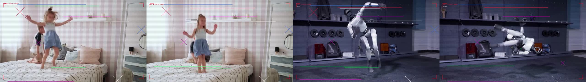
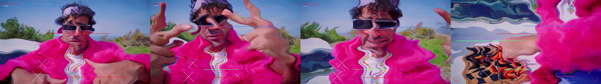
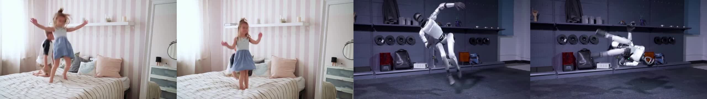

# MSCH Warp Wiggle showcase

Examples supplied by Mario from the MSCH Node Showcase collection. The output files are preserved as supplied.

TimeSlice-style warp & wiggle transition between two clips (last N frames of A into first N of B), a single-clip stylize variant, and a matching HUD overlay (crosshairs, bars, corner brackets, glitch text).

- transition_blocks_hud.mp4 - blocks pattern, center_out sweep, chromatic aberration, parallax, HUD with scanlines
- transition_slitscan_clean.mp4 - slit_scan pattern, left_to_right sweep, no HUD
- stylize_single_clip_hud.mp4 - Stylize on one clip with pulsing intensity + HUD

## Gallery

Click a video preview to open its file on GitHub, or use the download link.

### Stylize single clip hud

[Open MP4](outputs/stylize_single_clip_hud_00001.mp4) · [Download original](https://github.com/mariobilly/msch-comfyui-nodes/raw/refs/heads/main/components/warp_wiggle/examples/showcase/outputs/stylize_single_clip_hud_00001.mp4)

### Transition blocks hud

[Open MP4](outputs/transition_blocks_hud_00001.mp4) · [Download original](https://github.com/mariobilly/msch-comfyui-nodes/raw/refs/heads/main/components/warp_wiggle/examples/showcase/outputs/transition_blocks_hud_00001.mp4)

### Transition slitscan clean

[Open MP4](outputs/transition_slitscan_clean_00003.mp4) · [Download original](https://github.com/mariobilly/msch-comfyui-nodes/raw/refs/heads/main/components/warp_wiggle/examples/showcase/outputs/transition_slitscan_clean_00003.mp4)

## API workflows

These JSON files are ComfyUI API prompts, not canvas-format workflows. Send one as the `prompt` field of a `/prompt` request, or use a tool that accepts API workflows. A canvas importer may require conversion.

Choose your own source media and installed models before running. Source photos, video clips, audio and model weights are not bundled in this showcase. The supplied render settings and connections are retained; machine-specific absolute paths in the API copies use `INPUT_ROOT/` or `LOCAL_FILES/` placeholders. Replace these with paths valid on your computer.

- [warp_wiggle_api.json](workflows_api/warp_wiggle_api.json): `HUDOverlay`, `VHS_LoadVideo`, `VHS_VideoCombine`, `WarpWiggleStylize`, `WarpWiggleTransition`.

### Input files and models

| Workflow | Node | Input | Source selection |
|---|---|---|---|
| `warp_wiggle_api.json` | `1` | `video` | `msch_kids.mp4` |
| `warp_wiggle_api.json` | `2` | `video` | `msch_robot.mp4` |
| `warp_wiggle_api.json` | `11` | `video` | `msch_clipB.mp4` |

Install ComfyUI-VideoHelperSuite for the `VHS_*` loader/combine nodes.

## Source notes

The collection notes identify images from the Jim Morrison image library, Mario’s clips, and the Suno track “Crushing Syncopation”. Those source assets are not included separately. The rendered media is supplied as showcase material; the repository’s MIT license describes the node code and does not establish a separate license for underlying media.
